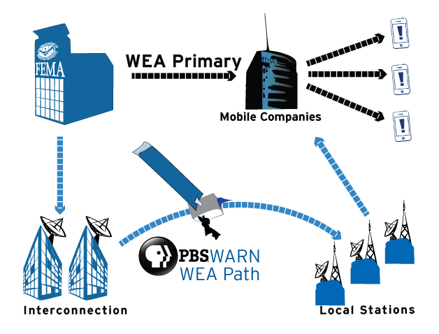

Data Product Pitch
========================================================
author: Aaron Silverman
date: May 8, 2017
autosize: true

WEA and PBS
========================================================

```r
knitr::opts_chunk$set(include = FALSE)
```


For the past three years, PBS has sent every [Wireless Emergency Alert (WEA)](https://www.fema.gov/frequently-asked-questions-wireless-emergency-alerts) message across the PBS satellite interconnection system and over-the-air as a part of the broadcast stream of each public television station. 

This system is known as [WARN, the Warning, Alert, and Response Network](http://pbs.org/about/WARN).

PBS WARN
======================================


Cellular providers can use PBS-WARN to back up their connections to [FEMA](https://www.fema.gov) so that the public is able to receive WEA messages even if a cellular company loses its internet connection to FEMA.

WEA Message Effects
========================================================

Preliminary studies by PBS have shown a significant decrease in tornado-related casualties since the advent of WEA messaging on April 7, 2012.  Injury and fatality rates for lightning and thunderstorm winds (which are not subject to WEAs) have not shown similar decreases.


The WARN Message Map
========================================================

Using notifications of WEA Messages, I have created a record of each county that these messages have reached over the past three years. Mousing over the choropleth reveals the name of the county and state along with the number of alerts sent to that state. 

Using the drop-down menu, the user can chose the specific type of alert distribution to examine, Total, AMBER, Tornado, Flash Flood, Tsunami, or Other. 


